# Procesverslag
**Auteur:** Marijn Kamerbeek - 500823229 - klas 203

## Bronnenlijst
**1. Elementen positioneren**
https://www.learnit.nl/gratiscursus/html-en-css/9

**2. Grid**
https://css-tricks.com/snippets/css/complete-guide-grid/

**3. Javascript**
https://css-tricks.com/video-screencasts/150-hey-designers-know-one-thing-javascript-recommend/

**4. Javascript menu**
https://www.youtube.com/watch?v=H4MkGzoACpQ&feature=youtu.be

## Herkansing (week 8)

**Wat heb ik uitgewerkt?**

Ik heb de homepagina uitgewerkt, en het artikel "Webinar voor trainers: technisch beleid in de praktijk". Door op de knop "lees meer" onder dat artikel te klikken kom je op die pagina terecht. Beide pagina's zijn responsive. Het menu bovenin is klikbaar. Dat is mijn micro-interactie gemaakt met wat code in javascript.

**Dit ging goed:**

Ondanks het feit dat ik opnieuw ben begonnen, ging het toch vlot. Het html document was snel verbetert. Ik heb ook meer om hulp gevraagd aan medestudenten, wat ik eigenlijk in eerste instantie niet had gedaan het afgelopen blok. Ik kon goed aan de slag met grid, en flex-box. Het responsive maken van de pagina ging ook makkelijker dan verwacht. Ik ben hard aan het werk gegaan en heb het zo volledig mogelijk afgerond.

**Dit ging niet zo goed:**

Ook merk ik dat de website die ik heb gekozen erg lastig is, vooral omdat ik zelf het erg lastig vind. Denk dat het daarom ook niet zo vlot ging. Het ging sneller dan eerst, maar ik had nog steeds moeite met wat onderdelen. Ik heb het daarom voor mezelf wat makkelijker gemaakt door sommige onderdelen weg te laten. Ik vond het lastig om te bepalen wanneer ik wel of niet een section of div moest toevoegen. Op de website zitten erg veel verschillende soorten onderdelen, die allemaal adnere opmaak nodig hebben. Uiteindelijk heb ik dus nog best veel gebruik gemaakt van sections, id's en sections. Al heb ik het geprobeerd zo weinig mogelijk te doen.

**Screenshot(s):**

- **Homepagina KNKV**

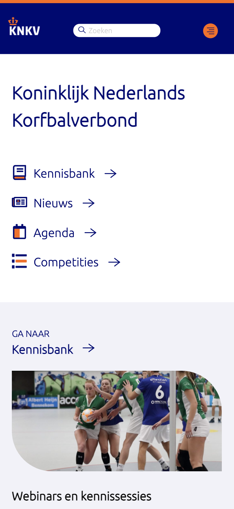
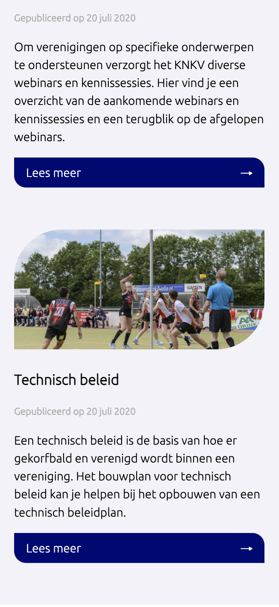
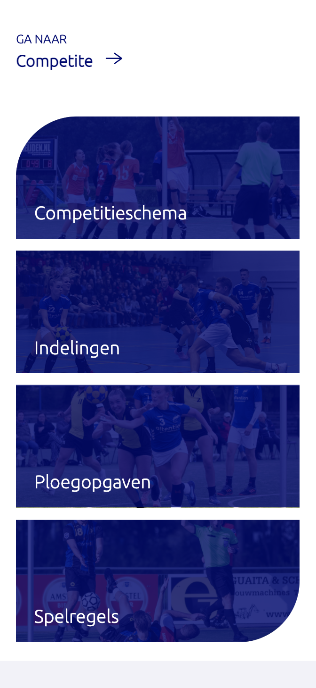
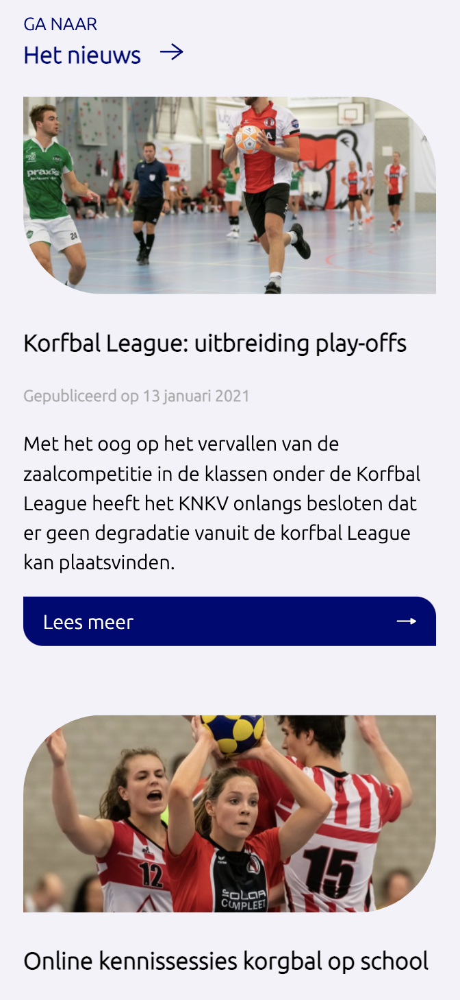
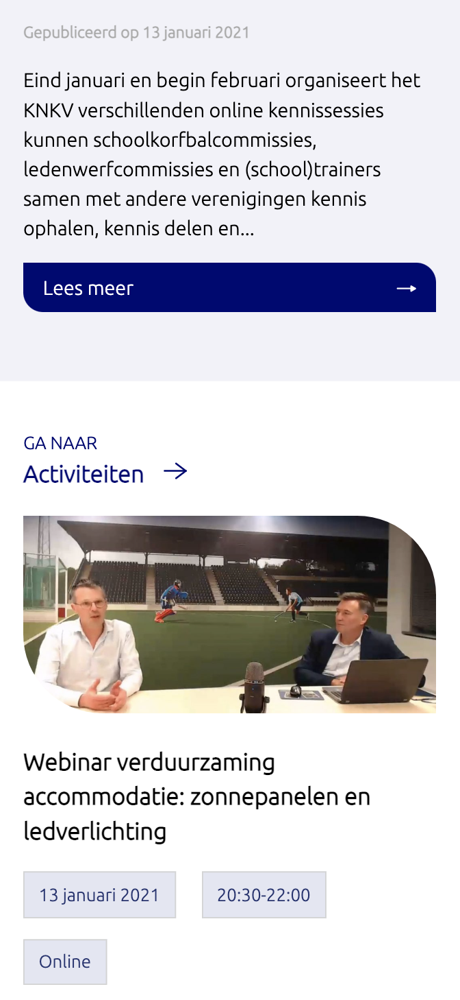
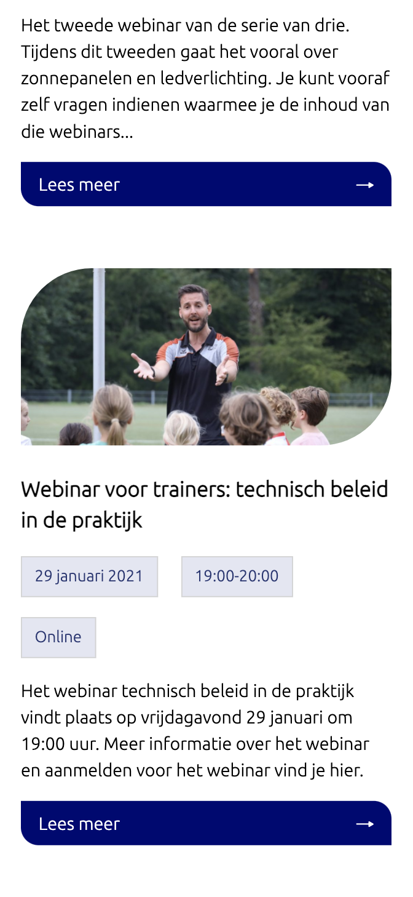
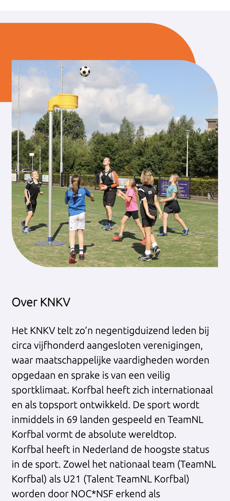
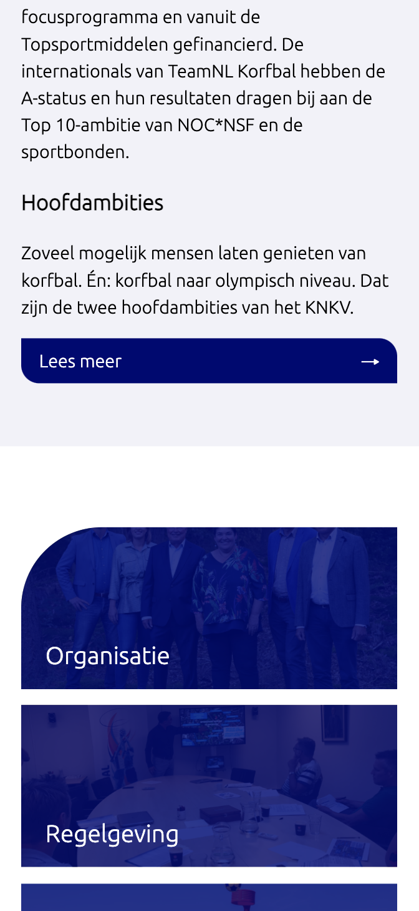
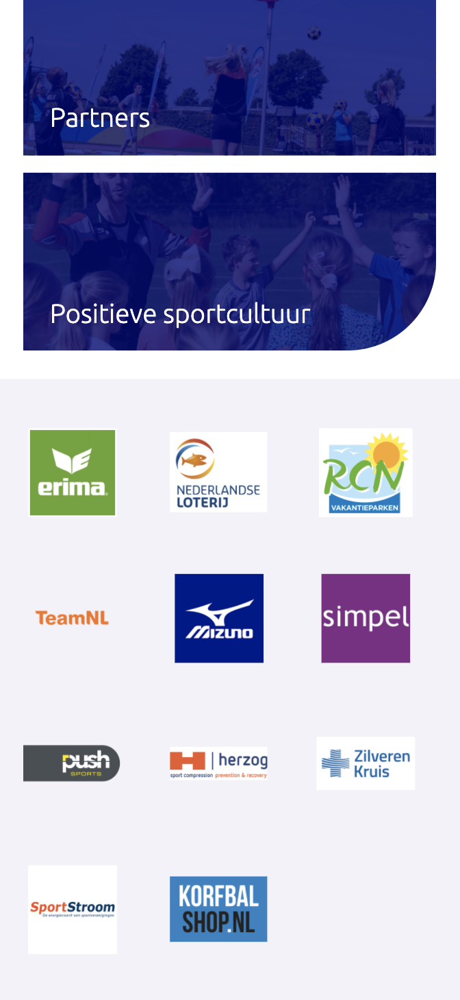
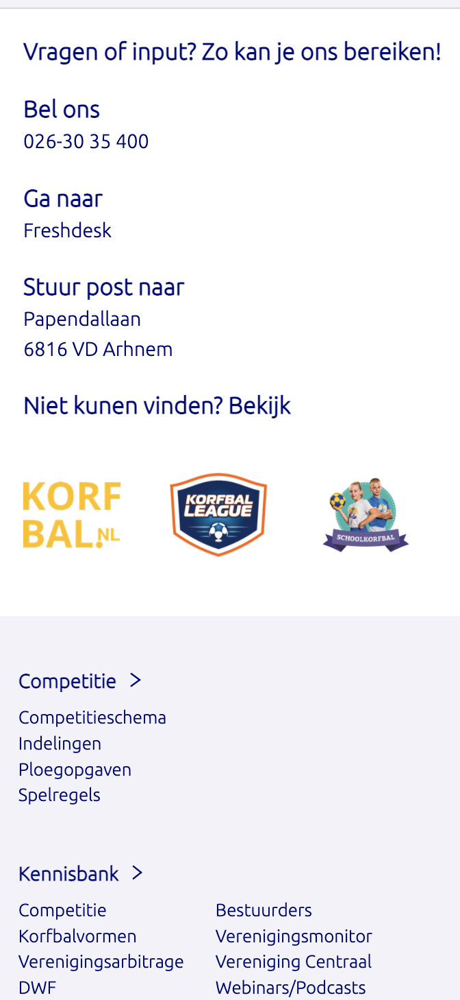
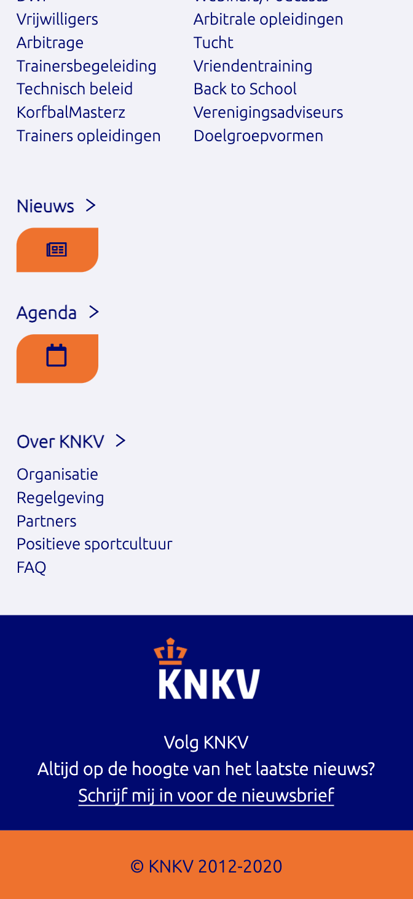

- **Artikel actviteit:** Webinar voor trainers: technisch beleid in de praktijk

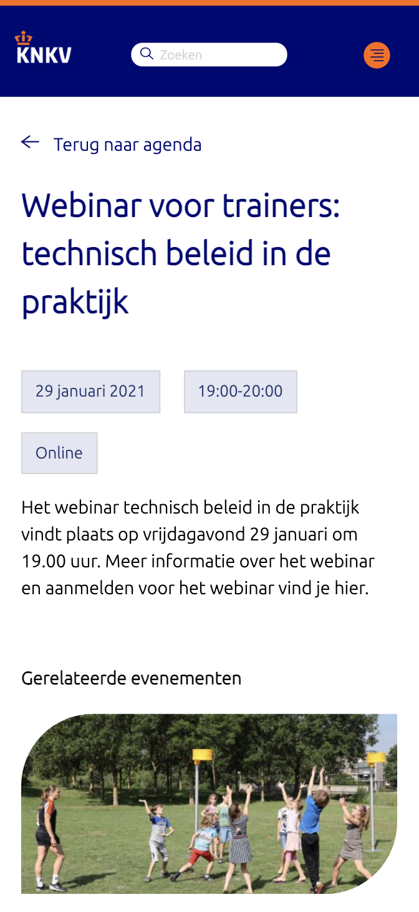
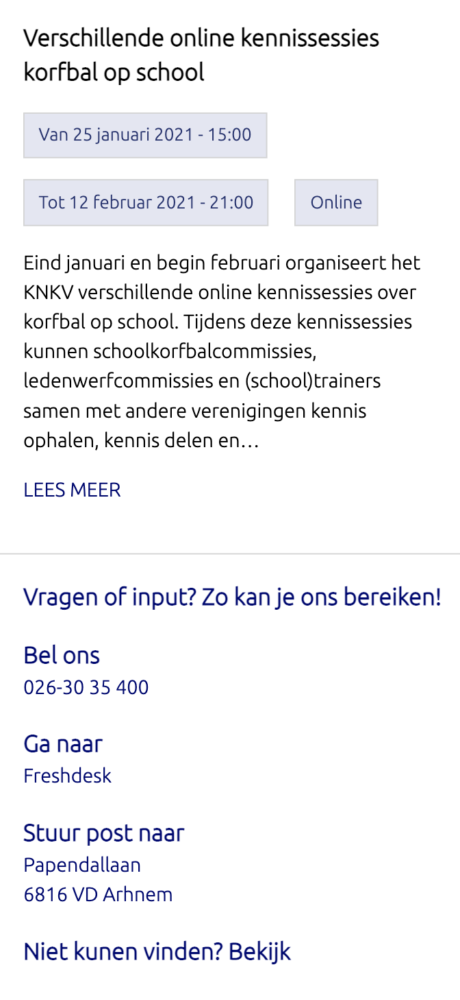
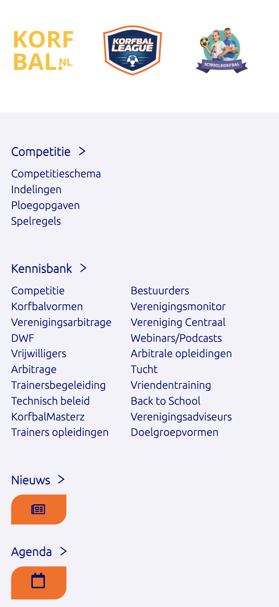
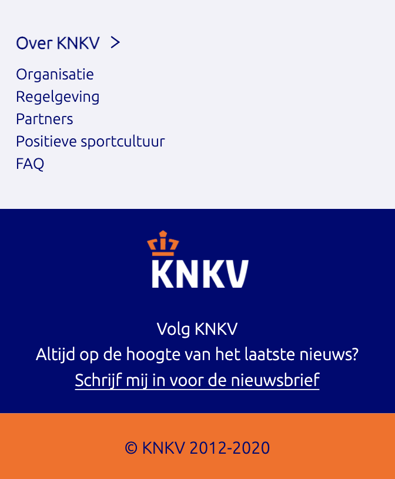

## Eindgesprek (week 7)

**Dit ging goed:**

In de laatste paar daagjes van de vakantie heb ik veel kunnen maken, en ging het al wat beter met het positioneren van elementen.

**Dit ging niet zo goed:**

Ik ben nog niet klaar, omdat ik het te lang heb uitgesteld en het niet vlot gaat. Nu is het bijna af voor mobiel, maar het werkt ook nog niet responsive. Ook moet er nog een stukje javascript in verwerkt worden. Ik denk dat als ik alle pixels verander naar em's, dat ik het dan redelijk snel responsive moet kunnen maken. Ook merk ik dat de website die ik heb gekozen erg lastig is, vooral omdat ik zelf het erg lastig vind. Denk dat het daarom ook niet zo vlot ging.

**Wat moet er vebetert worden?**

- Opnieuw beginnen met het html bestand, en zorgen dat alle headings kloppen
- Niet te veel classes gebruiken
- Niet te veel sections gebruiken: sections bij bluebuttons weghalen
- Alt tekst toevoegen aan de afbeeldingen
- Header in de body
- Bij de navsection een nav zetten
- Maak een ul en li
- Em & % gebruiken, niet px
- Box-sizing: border-box;

## Voortgang 3 (week 6)

**Dit ging goed:**

Ik heb best wel wat vooruitgang gemaakt sinds de vorige voortgang. Ik had namelijk daarvoor erg weinig gedaan.

**Dit ging niet zo goed:**

Ik heb nog steeds niet veel gemaakt na de vorige feedback. Ik merk dat ik vaak nijg om px te gebruiken ipv em. Dat zou ik later nog moeten aanpassen. Ook lukt het me na de feedback van sam nog niet met de blauwe overlay. Ik heb gedaan wat er in de mail stond, alleen lukt het niet helemaal.

## Voortgang 2 (week 5)

**Dit ging goed:**

Het toevoegen van foto's en iconen.

**Dit ging niet zo goed:**

Ik heb niet veel gedaan de afgelopen weken. Ik vind het lastig, dus het kostte me veel moeite om aan het werk te gaan. Ook het toepassen van flexbox en grid gaat nog niet helemaal goed. Het uitlijnen van elementen vind ik ook nog lastig.

## Voortgang 1 (week 3)

### Stand van zaken

**Dit ging goed:**

Het plaatsen van alle content ging vrij snel. Ik wist door de breakdownschets goed welke html elementen ik nodig had. Niet overal, maar op veel plekken wel.

**Dit ging niet zo goed:**

Ik heb wat moeite met hoe ik de header moet maken. Die heb ik nu eigenlijk helemaal nog niet. Ook het uitlijnen gaat wat moeizaam. Er zit ook bovein de website een slider, en ik heb nog geen idee hoe ik die moet maken. Mijn css staat ook nog een beetje onoverzichtelijk.

**Screenshot(s):**

Tot nu toe ben ik niet super ver. Ik heb alle content op de pagina staan. Ook de meeste afbeeldingen, en knoppen. Ik moet alles nog goed plaatsen, groottes aanpassen en iconen toevoegen. De hele header mist ook nog.

### Agenda voor meeting

**Waar willen we het over hebben?**

Kathleen: uitlijnen

Ruben: Responsive

Jordi: Slider

Marijn: uitlijnen(vooral afbeeldingen)

### Verslag van meeting

Tijdens de meeting zijn we kort langs elk aandachtspunt geegaan. We hebben het vooral gehad over uitlijnen.

## Breakdownschets (week 1)

## Intake (week 1)
**Je startniveau:** Mijn niveau op dit moment is blauw.

**Je focus:** Repsonsive

**Je opdracht:** https://www.knkv.nl/

**Screenshot(s) van de eerste pagina (small screen):**

**Screenshot(s) van de tweede pagina (small screen):**

