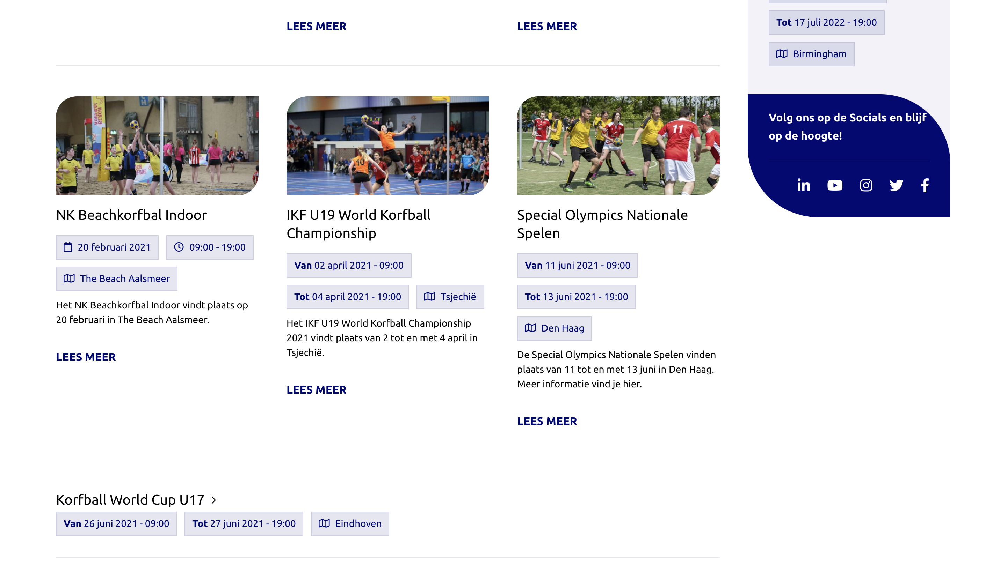

# Procesverslag
**Auteur:** Marijn

Markdown cheat cheet: [Hulp bij het schrijven van Markdown](https://github.com/adam-p/markdown-here/wiki/Markdown-Cheatsheet). Nb. de standaardstructuur en de spartaanse opmaak zijn helemaal prima. Het gaat om de inhoud van je procesverslag. Besteedt de tijd voor pracht en praal aan je website.

## Bronnenlijst
1. -bron 1-
2. -bron 2-
3. -...-

## Eindgesprek (week 7/8)

-dit ging goed & dit was lastig-

**Screenshot(s):**

-screenshot(s) van je eindresultaat-

## Voortgang 3 (week 6)

-same as voortgang 1-

## Voortgang 2 (week 5)

Dit ging goed:
Het toevoegen van foto's en iconen.

Dit ging niet zo goed:

Ik heb niet veel gedaan de afgelopen weken. Ik vind het lastig, dus het kostte me veel moeite om aan het werk te gaan. Ook het toepassen van flexbox en grid gaat nog niet helemaal goed. Het uitlijnen van elementen vind ik ook nog lastig.

## Voortgang 1 (week 3)

### Stand van zaken

Dit ging goed:

Het plaatsen van alle content ging vrij snel. Ik wist door de breakdownschets goed welke html elementen ik nodig had. Niet overal, maar op veel plekken wel.

Dit ging niet zo goed:

Ik heb watb moeite met hoe ik de header moet maken. Die heb ik nu eigenlijk helemaal nog niet. Ook het uitlijnen gaat wat moeizaam. Er zit ook bovein de website een slider, en ik heb nog geen idee hoe ik die moet maken. Mijn css staat ook nog een beetje onoverzichtelijk.

**Screenshot(s):**

Tot nu toe ben ik niet super ver. Ik heb alle content op de pagina staan. Ook de meeste afbeeldingen, en knoppen. Ik moet alles nog goed plaatsen, groottes aanpassen en iconen toevoegen. De hele header mist ook nog.

### Agenda voor meeting

Waar willen we het over hebben?
Kathleen: uitlijnen
Ruben: Responsive
Jordi: Slider
Marijn: uitlijnen(vooral afbeeldingen)

### Verslag van meeting

-na afloop snel uitkomsten vastleggen-

## Breakdownschets (week 1)

## Intake (week 1)
-uitwerken voor de kick-off werkgroep - begin van de eerste week-

**Je startniveau:**  Mijn niveau op dit moment is blauw.

**Je focus:** Surface plane

**Je opdracht:** https://www.etos.nl/

**Screenshot(s) van de eerste pagina (small screen):**

**Screenshot(s) van de tweede pagina (small screen):**

